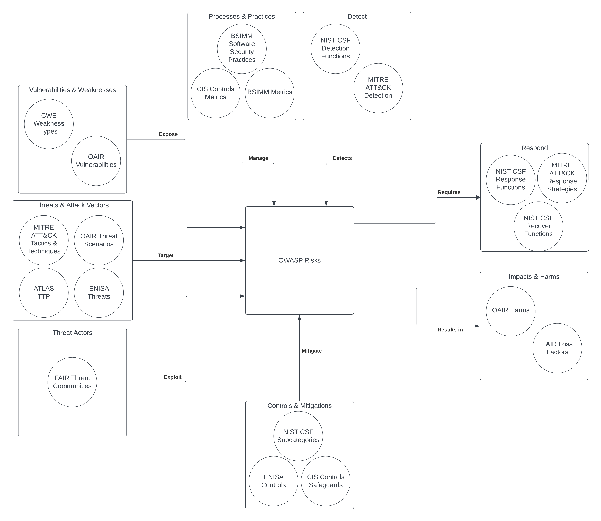

# Introduction
The OWASP Top 10 provides the top 10 critical security risks for web applications. The OWASP Top 10 for Large Language Model Applications project aims to provide a similar standard set of risks specifically for applications integrated with language models. To augment these LLM risks, we will map the OWASP Top 10 for LLM applications to several complementary cybersecurity frameworks for a more holistic perspective:

- The [Common Weakness Enumeration (CWE)](https://cwe.mitre.org/) serves as a dictionary of software weaknesses. CWEs provide standardized concepts that classify the types of weaknesses related to the OWASP LLM risks. Mapping CWEs helps identify the core vulnerability types that could lead to or underlie the OWASP risks.

- [MITRE ATT&CK](https://attack.mitre.org/) is a knowledge base of real-world adversary tactics and techniques. Mapping ATT&CK techniques provides insights into how adversaries could actually exploit the OWASP LLM risks in practice. This intelligence can inform threat modeling and defenses.

- The [NIST Cybersecurity Framework](https://www.nist.gov/cyberframework) delivers guidelines and best practices for managing organizational cybersecurity risk. Mapping NIST CSF helps relate the OWASP risks to recognized standards and controls, providing mature mitigation guidance.

- [CIS Controls](https://www.cisecurity.org/controls/) provides prescriptive cybersecurity safeguards and metrics. Mapping CIS Controls gives tangible, measurable security steps to prevent, detect, and respond to the OWASP LLM risks.

- [FAIR](https://www.riskmanagementinsight.com/) supports quantitative cyber risk analysis. Mapping FAIR provides data-driven risk evaluation of the potential loss impacts related to the OWASP LLM risks.

- [BSIMM](https://www.bsimm.com/) documents real-world software security best practices. Mapping BSIMM helps relate the OWASP risks to proven security processes and maturity benchmarks.

- [ENISA Threat Landscape](https://www.enisa.europa.eu/) examines emerging threats to AI systems. Mapping ENISA helps identify OWASP LLM risks unique to the AI domain that may not be highlighted in traditional frameworks.

- [OAIR Framework](https://www.operationalizingai.org/) identifies risks across the AI system lifecycle. Mapping OAIR relates the OWASP risks to AI-specific vulnerabilities and harms providing visibility into AI relevance.

- [ATLAS](https://atlas.mitre.org/) documents observed real-world attacks against AI. Mapping ATLAS builds understanding of how the OWASP risks manifest in actual AI threat scenarios based on evidence.

This cross-framework mapping aims to connect the dots between OWASP risks and complementary frameworks. 

1. **Vulnerabilities & Weaknesses**
   - CWE weakness types
   - OAIR vulnerabilities
   - Arc: exposes OWASP Risk

2. **Threats & Attack Vectors**
   - MITRE ATT&CK tactics and techniques
   - ATLAS tactics, techniques, and procedures
   - ENISA threats
   - OAIR Threat Scenarios
   - Arc: targets OWASP Risk

3. **Threat Actors**
   - FAIR threat communities
   - Arc: exploit OWASP Risk

4. **Impacts & Harms**
   - OAIR harms
   - FAIR loss factors
   - Arc: result from OWASP Risk

5. **Controls & Mitigations**
   - CIS Controls Safeguards
   - ENISA controls
   - NIST CSF Subcategories
   - Arc: mitigates OWASP Risk

6. **Processes & Practices**
   - BSIMM software security practices
   - BSIMM metrics
   - CIS Controls metrics
   - Arc: manages OWASP Risk

7. **Detection Strategies**
   - NIST CSF detect function
   - MITRE ATT&CK Detection
   - Arc: addresses OWASP Risk

8. **Response Strategies**
   - NIST CSF respond function
   - NIST CSF recover function
   - MITRE ATT&CK Response
   - Arc: manages OWASP Risk

TODO: expand definitions like this

ATT&CK tactics represent the high-level steps or stages in the adversary's plan to accomplish the goal of successfully performing a prompt injection attack. For example, common tactics relevant to prompt injection may include initial access, execution, persistence, and exfiltration.
ATT&CK techniques demonstrate the specific methods and means through which the adversary executes each of those high-level attack steps or tactics. For example, spearphishing attachment and supply chain compromise are techniques an attacker could use to achieve the initial access tactic in a prompt injection attack.
