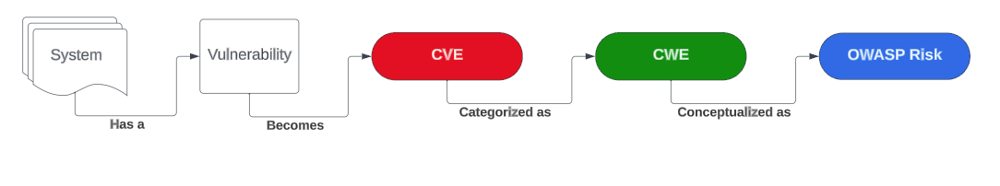
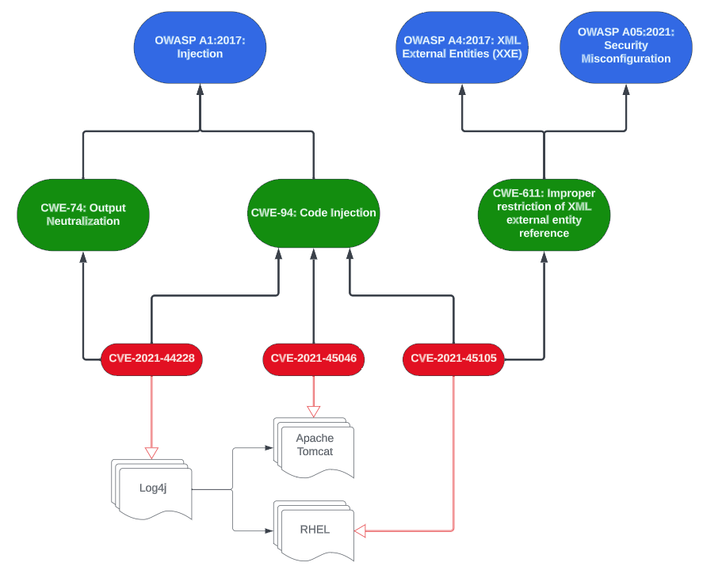

Bob Simonoff, September 18, 2023

- LinkedIn at https://www.linkedin.com/in/bob-simonoff

- medium.com at https://medium.com/@bob.simonoff

- github at https://github.com/Bobsimonoff/LLM-4-Applications-Commentary/tree/main

# The Ah Ha Moment
I've recently learned that OWASP Top 10 focuses on **risks** not vulnerabilities. The very first page of the [OWASP Top 10](https://owasp.org/www-project-top-ten/) says "The OWASP Top 10 is a standard awareness document for developers and web application security. **It represents a broad consensus about the most critical security risks to web applications.**"

So, in my mind... ~~vulnerabilities~~ risks should be the focus of the OWASP Top 10 for Large Language Models. However, understanding vulnerabilities can still provide value, as the two perspectives are complementary. More follows. 

# Background
I am not a security expert so I thought I would look into what is the exact difference.  My take is:

* A vulnerability is a weakness or flaw in a software application system, etc. that can be exploited by attackers to compromise the security or functionality of the system. An exploitable buffer overflow is a vulnerability.
  
* A risk is more about the potential for harm or adverse events resulting from the exploitation of vulnerabilities.  Examples include [A03:2021-Injection](https://owasp.org/Top10/A03_2021-Injection/), [A09:2021-Security Logging and Monitoring Failures](https://owasp.org/Top10/A09_2021-Security_Logging_and_Monitoring_Failures/), and [A02:2021-Cryptographic Failure](https://owasp.org/Top10/A02_2021-Cryptographic_Failures/).

So, how does all this connect together? 
Take this picture...

and this picture...

Consider the log4J vulnerability that was widely reported. It was a specific bug in a specific version of a specific piece of software. That software **vulnerability** was reported in MITRE's vulnerability database, among other places. It was assigned a unique identifier: CVE-2021-44228.  As other software was reported to be vulnerable as a result of using log4J, they were assigned their own vulnerability identifier and entry in the MITRE vulnerability database. Apache tomcat has CVE–2021–45046, while Red Hat Enterprise Linux has CVE-2021-45105 is an example. Note, CVE stands for Common Vulnerability and Exposure. 

Meanwhile, the software security community has created and continues to maintain a taxonomy of common weaknesses that are found or may be found in systems. A Common Weakness Enumeration (CWE) categorize other weaknesses and vulnerabilities. For example, the log4j vulnerability noted above was associated with the following CWEs:  

* CVE-2021-44228 (Log4j):  CWE-94 Code Injection, CWE-74 Output Neutralization

* CVE-2021-45046 (Apache Tomcat): CWE-94 Code Injection, CWE-200 Exposure of Sensitive Information

* CVE-2021-45105 (Red Hat Enterprise Linux): CWE-94 Code Injection, CWE-611 Improper restriction of XML external entity reference.

OWASP maps each of its ~~vulnerabilities~~ risks to one or more weaknesses/CWEs. This allows specific vulnerabilities, like those resulting from log4j, to be tracked against higher-level weaknesses (CWEs) and ultimately risks as enumerated in the OWASP Top 10. 

The log4j CWEs were mappable to OWASP ~~vulnerabilities~~ risks as follows:
* CWE-74, CWE-94: OWASP A1:2017 Injection 
* CWE-611: OWASP A4:2017 XML External Entities (XEE), OWASP A05:2021 Security Misconfiguration

So while understanding log4j requires analyzing the specific vulnerability, managing the broader idea of security risks requires higher level thinking.
 

# Implications for the LLM Applications Top 10
When evaluating risks for LLM-integrated applications, thinking about vulnerabilities and risks is helpful. I'll analyze some example entries from the LLM Applications Top 10 to demonstrate.

[LLM09:Overreliance](https://llmtop10.com/llm09/)

Through a vulnerability lens, overreliance is difficult to pin down technically. It is a people/process issue, people trust generative AI because it speaks convincingly whether or not it's hallucinating. But as a risk, it is clearly relevant, as users may trust incorrect LLM outputs. 

[Sensitive Information Disclosure](https://llmtop10.com/llm06/)

As a vulnerability, this is vague and certainly not a root cause. However, it certainly represents a relevant risk in LLM applications. 

[Insecure Plugin Design](https://llmtop10.com/llm07/)

While plugins face traditional validation issues already in the [OWASP top 10](https://owasp.org/Top10/) list, risks related to hallucination and natural language are distinct in LLM systems. But, general secure design principles apply too. lWhile large language model applications are a subset of the universe of software systems, the vulnerabilities associated with them may have different incident/precedence rates compared with traditional software systems because the interface is different and much more difficult to manage. 

 [Supply Chain Vulnerabilities](https://llmtop10.com/llm05/)
 
 Since the flagship top 10 list already has [A06:2021-Vulnerable and Outdated Components](https://owasp.org/Top10/A06_2021-Vulnerable_and_Outdated_Components/) it is possible this entry is redundant. Time will tell as vulnerabilities are reported. 

# Conclusion
The change, in my mind only, from a focus on vulnerabilities to risks results in a different perspective on what should be covered in the large language model application top 10 list and how it should be treated.  
  
By focusing on risks, the LLM Top 10 will highlight relevant high-level security priorities. But because risks arise from vulnerabilities, we cannot ignore the technical details, even if abstracted. The two perspectives together can guide more robust security practices. 

